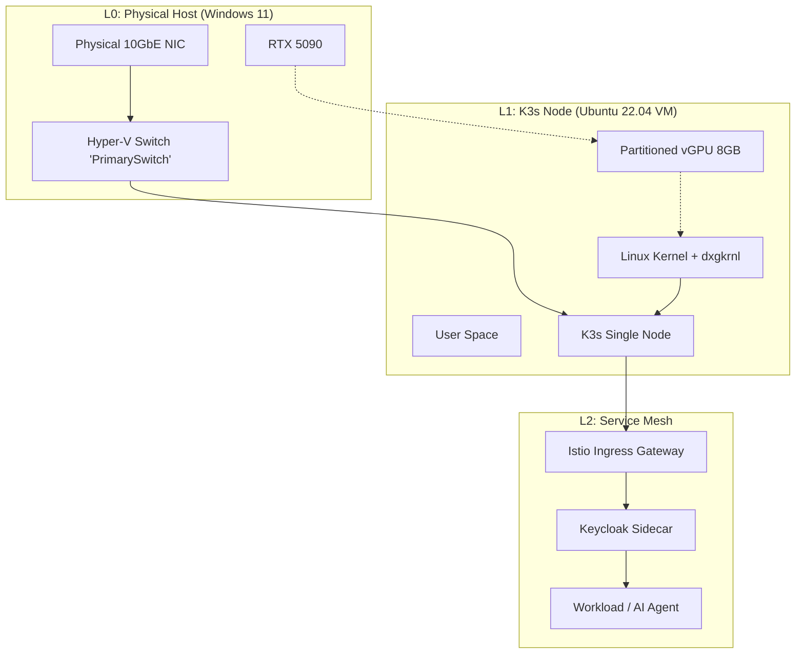
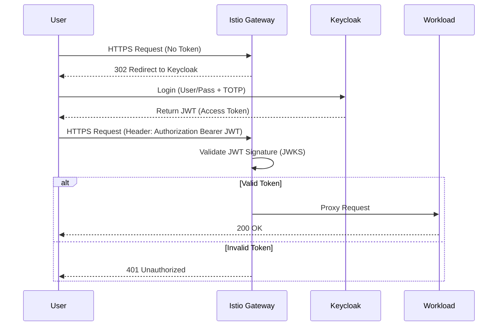

# 🚀 Homelab & AI Orchestration: Master Engineering Specification

## Executive Summary
This project implements a **High-Assurance Hybrid Cloud** environment on local hardware. The mission is to provide a production-grade playground for **AI Agent Orchestration** and **Media Automation** while maintaining strict **NIST 800-53 Rev 5** security controls.

### Hardware Core
* **CPU:** AMD Ryzen 9 9950X3D (16C/32T) — *AMD-V & SVM Enabled*
* **GPU:** NVIDIA RTX 5090 (32GB VRAM) — *GPU-P Enabled*
* **Memory:** 64GB DDR5 (ECC Preferred)
* **Storage:** NVMe Gen5 RAID (Data Integrity Layer)

---

## 1. System Architecture & Virtualization Topology 🏗️

The environment utilizes **Type 1 Hypervisor (Hyper-V)** to host the AI workload directly. This eliminates nested virtualization overhead and solves kernel compatibility issues for GPU partitioning.

### 1.1 Virtualization & Network Topology (L1)



### 1.2 Resource Allocation

| Hardware Component | Allocation Strategy | Host (Win 11) | Guest (Ubuntu VM) |
| :--- | :--- | :--- | :--- |
| **CPU (9950X3D)** | Game Mode Scheduling | 8 Cores (Gaming) | 8 Cores (Lab Services) |
| **GPU (RTX 5090)** | GPU-P (Partitioning) | 100% 3D / Video Enc | ~25-50% CUDA Compute |
| **RAM (64GB)** | Static Allocation | 32GB Reserved | 32GB Static |
| **Network** | Virtual Switch | 10GbE Native | Virtualized Bridge |

---

## 2. NIST 800-53 Rev 5 Compliance Mapping 🛡️

All technical decisions are mapped to federal security standards to ensure a "production-grade" posture.

| NIST ID | Control Family | Technical Implementation | Logic Detail |
| :--- | :--- | :--- | :--- |
| **AC-2** | Account Mgmt | **Keycloak OIDC** | Disables local `/etc/shadow` passwords; forces OIDC login. |
| **AC-3** | Access Enforcement | **Istio AuthPolicy** | Default "Deny-All" ingress; requires valid JWT for all routes. |
| **AC-6** | Least Privilege | **K8s RBAC** | ClusterRoles mapped to Keycloak groups (`admins`, `devs`). |
| **IA-2** | Identification/Auth | **MFA (TOTP)** | Mandatory 2FA at Istio Gateway; seeds encrypted in Keycloak DB. |
| **IA-8** | Non-Org Users | **Tailscale ACLs** | Mesh-only access for remote management. |
| **AU-2** | Event Logging | **Grafana Loki** | Log levels: `info` for applications, `audit` for API server. |
| **SC-8** | Transmission | **Istio mTLS** | X.509 certs rotated via Citadel; mTLS mode: `STRICT`. |

---

## 3. Secret Management Specification (SOPS + age) 🔑

All sensitive data in this repository is encrypted using **SOPS** with the **age** backend to ensure no plaintext secrets are committed to GitHub.

### 3.1 Encryption Policy (`.sops.yaml`)

```yaml
creation_rules:
  - path_regex: .*\.enc\.yaml$
    key_groups:
      - age:
          - age1your_public_key_here # Replace with your public key
```

### 3.2 Secret Injection Workflow

1.  **Generate Master Key**:
    ```powershell
    age-keygen -o "$env:AppData\sops\age\keys.txt"
    ```
2.  **Set Environment Variable**:
    ```powershell
    $env:SOPS_AGE_KEY_FILE="$env:AppData\sops\age\keys.txt"
    ```
3.  **Encrypt a Secret**:
    ```bash
    sops -e -i kubernetes/apps/media/secrets.enc.yaml
    ```
4.  **Decrypt (Verify)**:
    ```bash
    sops -d kubernetes/apps/media/secrets.enc.yaml
    ```

---

## 4. Service Mesh & Zero-Trust Networking (Istio + Keycloak) 🌐

### 4.1 Authentication Request Flow (NIST IA-2)



### 4.2 Peer Authentication (mTLS Strict)

Enforces end-to-end encryption for all inter-pod traffic.

```yaml
apiVersion: security.istio.io/v1beta1
kind: PeerAuthentication
metadata:
  name: default
  namespace: istio-system
spec:
  mtls:
    mode: STRICT # Rejects all non-encrypted or non-mTLS traffic
```

---

## 5. The GPU Pipeline: Gaming & AI Coexistence 🏎️

To utilize the RTX 5090 for both 4K gaming and AI workloads, we implement **GPU Partitioning (GPU-P)** directly on Hyper-V.

### 5.1 Host-Level Partitioning Logic (PowerShell)
Handled automatically by `scripts/provision-ubuntu.ps1`.

### 5.2 Guest Configuration
*   **OS**: Ubuntu 22.04 LTS (Kernel 6.x+ `linux-image-azure`)
*   **Driver**: NVIDIA Server Driver 535+
*   **Runtime**: Nvidia Container Toolkit

---

## 6. Implementation Flight Manual ⚓

### Step 1: BIOS & Hardware Prep
Enable SVM, IOMMU, SR-IOV in BIOS.

### Step 2: Host Tooling (PowerShell Admin)
```powershell
choco install -y git ansible sops age.portable kubernetes-cli kubernetes-helm
```

## Current State (AS-IS) 🚧

**Architecture:**
*   **Host:** Windows 11 Pro (Hyper-V)
*   **Guest:** Ubuntu 22.04 LTS (Generation 2 VM, Secure Boot Disabled)
*   **Networking:** Static IP `192.168.71.150`, MetalLB Range `192.168.71.160-180`.
*   **GPU:** RTX 5090 (32GB) passed via DDA/GPU-P.
*   **Driver Strategy:** **Host Driver Injection** (WSL2-style). We copy Windows drivers to Linux. Standard Linux drivers do NOT work with Consumer cards in this setup.

## Quick Start

### 1. Provision Infrastructure
Run the PowerShell script to create the VM and apply GPU partitioning:
> **Note:** Requires `Administrator` privileges.

```powershell
.\scripts\provision-ubuntu.ps1
```

### 2. Inject Host Drivers (Critical!)
Because we are using a Consumer GPU (GeForce), we must inject the Windows drivers into the VM.

**Step A: Copy Drivers from Host (Run on Windows)**
```powershell
.\scripts\inject-drivers.ps1
```

**Step B: Install Drivers in VM (Run on Ubuntu)**
```bash
sudo ./k3slab/scripts/install-host-drivers.sh
sudo reboot
```

### 3. Deploy Cluster (Ansible)

### Step 3: Provisioning K3s Node (PowerShell)

We use a unified script to create the Ubuntu VM, configure the Network, and partitioning the GPU.

**Prerequisite:** Download **Ubuntu 22.04 Server**

```powershell
# Run in Admin PowerShell
# Run in Admin PowerShell
.\scripts\provision-ubuntu.ps1
# (Default ISO path: D:\ISOs\ubuntu-24.04.3-live-server-amd64.iso)
```

> [!IMPORTANT]
> **RTX 5090 / Consumer GPU "Insufficient Resources" Error:**
> If the VM fails to start with `0x800705AA`, the Host is likely reporting a capped "Partitionable Limit" (often 953MB).
> **Fix:** Manually set the partition size to be *under* this limit (e.g., 512MB) using `Set-VMGpuPartitionAdapter`. This is just a reservation; the Guest will still access the full VRAM.

1.  Connect to the VM ("K3s-Node").
2.  Install Ubuntu Server.
    *   **Important**: Enable "Install OpenSSH Server".
3.  Note the IP address (`ip addr`).

### Step 4: K3s & AI Bootstrap (Ansible)

We use Ansible to provision the cluster and drivers.

1.  **Update Inventory**: Ensure `ansible/inventory/hosts.ini` uses `localhost` (since we run the script *on* the VM).
2.  **Bootstrap**:

```bash
# On the Ubuntu VM (SSH in first)
# Copy project to VM (Run from Host)
scp -r -o StrictHostKeyChecking=no . bbreckenridge@192.168.71.150:~/k3slab

chmod +x scripts/bootstrap-ansible.sh
./scripts/bootstrap-ansible.sh
```

This acts as a "One-Click Deploy" for:
*   K3s Cluster
*   Networking (MetalLB + Istio)
*   NVIDIA Drivers & Container Toolkit

### Step 5: Verification

**Check GPU:**
```bash
nvidia-smi
# Should list the RTX 5090 (partitioned)
```

**Check Kubernetes:**
```bash
kubectl describe node | grep nvidia.com/gpu
# Should show capacity: 1
```

---

## 7. Repository Directory Structure 📂

```text
k3slab/
├── .sops.yaml                # Secret encryption policy
├── .gitignore                # Git exclusion rules
├── ansible/                  # Configuration Management
│   ├── playbooks/            # K3s install, GPU setup
│   └── inventory/            # Dynamic host mapping
├── kubernetes/               # GitOps Manifests (ArgoCD)
│   ├── core/                 # Istio, Keycloak, ArgoCD
│   ├── apps/                 # *arr Stack, AI Agents
│   └── nvidia/               # Device Plugins
└── scripts/                  # Provisioning & Bootstrap
    ├── provision-ubuntu.ps1    # Hyper-V VM Creator
    ├── bootstrap-ansible.sh    # Guest Configuration Script
    ├── inject-drivers.ps1      # Host Driver Extractor
    ├── install-host-drivers.sh # Guest Driver Installer
    └── configure-static-ip.sh  # IP Configuration
```

## 8. Storage & Backup Strategy 💾

### 8.1 Storage Architecture (Hyper-V + Ubuntu)
We utilize a mix of virtualized disks and passed-through NVMe storage for performance and data integrity.

| Dataset | Mount Point | Source | Strategy |
| :--- | :--- | :--- | :--- |
| **OS / Etcd** | `/var/lib/rancher` | VHDX (OS Drive) | Standard ext4 |
| **Media Library** | `/mnt/media` | SMB Mount / VHDX | Data Drive (Separate VHDX) |
| **AI Models** | `/mnt/models` | Local NVMe | High-perf scratch space |

### 8.2 Backup Policy (3-2-1 Rule)

| Type | Source | Destination | Frequency | Tool |
| :--- | :--- | :--- | :--- | :--- |
| **Cluster State** | K3s Etcd | TrueNAS / S3 | Hourly | `velero` |
| **Config** | GitHub Repo | Local + GitHub | Push-Trigger | `git` |
| **VM Snapshots** | Hyper-V | NAS / External HDD | Weekly | `Checkpoints` |

---

## 9. Day 1 Checklist ✅

- [ ] **BIOS**: Enable SVM, IOMMU, SR-IOV.
- [ ] **Hyper-V**: Feature enabled in Windows.
- [ ] **Network**: Create External V-Switch "PrimarySwitch".
- [ ] **Tools**: Install Choco, Git, Ansible, SOPS.
- [ ] **Keys**: Generate `age` key for SOPS.
- [ ] **Provision**: Run `scripts/provision-ubuntu.ps1`.
- [ ] **Install**: Install Ubuntu Server 22.04 LTS on the VM.
- [ ] **Drivers**: Inject Windows Drivers using `scripts/inject-drivers.ps1`.
- [ ] **Kernel**: Install `linux-image-azure` on VM.
- [ ] **Bootstrap**: Run `scripts/bootstrap-ansible.sh`.
- [ ] **Verify**: Check `nvidia-smi` and `kubectl get nodes`.