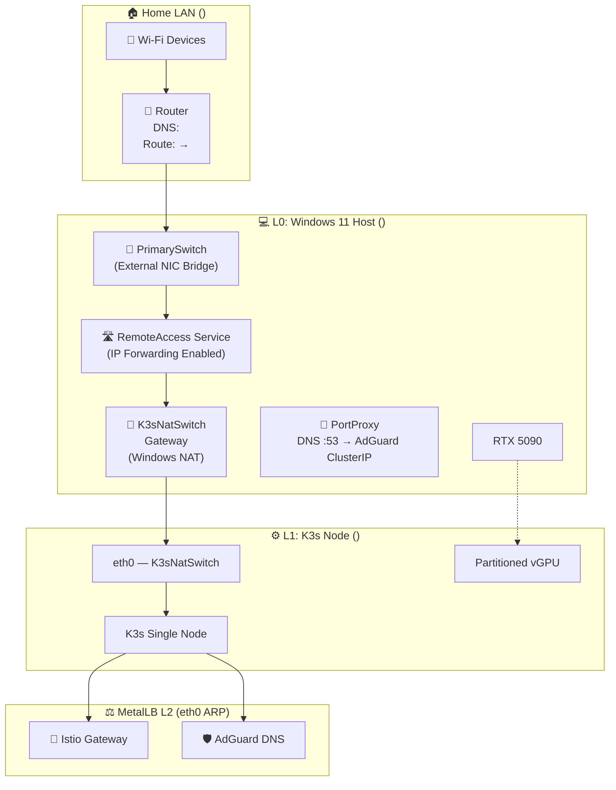
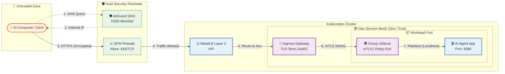
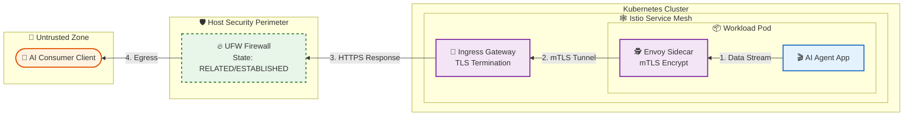
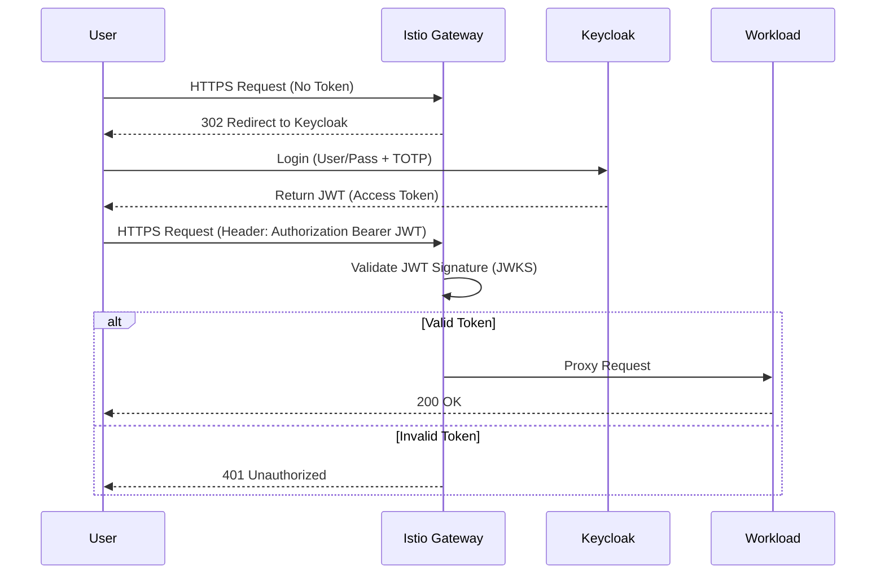

# 🚀 Homelab & AI Orchestration: Master Engineering Specification

## Executive Summary
This project implements a **High-Assurance Hybrid Cloud** environment on local hardware. The mission is to provide a production-grade playground for **AI Agent Orchestration** and **Media Automation** while maintaining strict **NIST 800-53 Rev 5** security controls.

### Hardware Core
* **CPU:** AMD Ryzen 9 9950X3D (16C/32T) — *AMD-V & SVM Enabled*
* **GPU:** NVIDIA RTX 5090 (32GB VRAM) — *GPU-P Enabled*
* **Memory:** 64GB DDR5 (ECC Preferred)
* **Storage:** NVMe Gen5 RAID (Data Integrity Layer)

---

## 1. System Architecture & Virtualization Topology 🏗️

The environment utilizes **Type 1 Hypervisor (Hyper-V)** to host the AI workload directly. This eliminates nested virtualization overhead and solves kernel compatibility issues for GPU partitioning.

### 1.1 Resource Allocation

| Hardware Component | Allocation Strategy | Host (Win 11) | Guest (Ubuntu VM) |
| :--- | :--- | :--- | :--- |
| **CPU (9950X3D)** | Game Mode Scheduling | 24 vThreads (Host) | 8 vCPUs (Lab Services) |
| **GPU (RTX 5090)** | GPU-P (Partitioning) | 100% 3D / Video Enc | ~25-50% CUDA Compute |
| **RAM (64GB)** | Static Allocation | 48GB Reserved | 16GB Static |
| **Network** | Virtual Switch | 10GbE Native | Virtualized Bridge |

### 1.2 Virtualization & Network Topology (L1)

> [!IMPORTANT]
> The K3s VM uses a **single NIC** connected exclusively to the internal `K3sNatSwitch` (e.g., `<K3S-SUBNET>`). Internet access flows through Windows NAT via the gateway. The `PrimarySwitch` (external) adapter was intentionally removed from the VM to eliminate asymmetric routing.



### 1.2.1 Secure Traffic Flow (Life of a Packet) 📡

This diagram illustrates the **Zero Trust** path for a user accessing internal applications (e.g., an AI Agent Dashboard). All traffic is inspected, authenticated, and encrypted before reaching the workload.



### 1.2.2 Secure Traffic Flow (The Return Path) ↩️

Data returning to the user (e.g., streaming inference results) typically follows an established path allowed by the stateful firewall.



---

## 2. NIST 800-53 Rev 5 Compliance Mapping 🛡️

All technical decisions are mapped to federal security standards to ensure a "production-grade" posture.

| NIST ID | Control Family | Technical Implementation | Logic Detail |
| :--- | :--- | :--- | :--- |
| **AC-2** | Account Mgmt | **Keycloak OIDC** | Disables local `/etc/shadow` passwords; forces OIDC login. |
| **AC-3** | Access Enforcement | **Istio AuthPolicy** | Default "Deny-All" ingress; requires valid JWT for all routes. |
| **AC-6** | Least Privilege | **K8s RBAC** | ClusterRoles mapped to Keycloak groups (`admins`, `devs`). |
| **IA-2** | Identification/Auth | **MFA (TOTP)** | Mandatory 2FA at Istio Gateway; seeds encrypted in Keycloak DB. |
| **IA-8** | Non-Org Users | **Tailscale ACLs** | Mesh-only access for remote management. |
| **AU-2** | Event Logging | **Prometheus & Loki** | Aggregates metrics and logs from all pods in single-binary mode for resource efficiency. |
| **SC-8(1)** | Cryptographic Protection | **Cert-Manager / Let's Encrypt** | Automated wildcard TLS certificate rotation via Cloudflare DNS-01 challenges. |
| **SC-8** | Transmission | **Istio mTLS** | X.509 certs rotated via Citadel; mTLS mode: `STRICT`. |
| **SC-7** | Boundary Protection | **UFW Firewall** | Deny-All incoming; explicit allow for K3s/SSH only. |
| **SC-7(10)** | Deny by Default | **AdGuard Home** | Blocks known malicious domains via OISD threat lists natively. |
| **SI-4** | System Monitoring | **Grafana & Prometheus** | Real-time dashboards for health, resource usage, and security events. |
| **SI-2** | Flaw Remediation | **Unattended Upgrades** | Automatic installation of critical security patches. |

---

## 3. Secret Management Specification (SOPS + age) 🔑

All sensitive data in this repository is encrypted using **SOPS** with the **age** backend to ensure no plaintext secrets are committed to GitHub.

### 3.1 Encryption Policy (`.sops.yaml`)

```yaml
creation_rules:
  - path_regex: .*\.enc\.yaml$
    key_groups:
      - age:
          - age1your_public_key_here # Replace with your public key
```

### 3.2 Secret Injection Workflow

1.  **Generate Master Key**:
    ```powershell
    age-keygen -o "$env:AppData\sops\age\keys.txt"
    ```
2.  **Set Environment Variable**:
    ```powershell
    $env:SOPS_AGE_KEY_FILE="$env:AppData\sops\age\keys.txt"
    ```
3.  **Encrypt a Secret**:
    ```bash
    sops -e -i ansible/inventory/group_vars/all/secrets.enc.yaml
    ```
4.  **Decrypt (Verify)**:
    ```bash
    sops -d ansible/inventory/group_vars/all/secrets.enc.yaml
    ```

---

## 4. Service Mesh & Zero-Trust Networking (Istio + Keycloak) 🌐

### 4.1 Authentication Request Flow (NIST IA-2)



### 4.2 Peer Authentication (mTLS Strict)

Enforces end-to-end encryption for all inter-pod traffic.

```yaml
apiVersion: security.istio.io/v1beta1
kind: PeerAuthentication
metadata:
  name: default
  namespace: istio-system
spec:
  mtls:
    mode: STRICT # Rejects all non-encrypted or non-mTLS traffic
```

---

## 4.3 Platform Services Stack 🧩

Core shared services provide identity, observability, and remote access.

| Service | Component | Function | Access |
| :--- | :--- | :--- | :--- |
| **Tailscale** | **Remote Access** | Secure, zero-config VPN for accessing the host/cluster from anywhere. | `sudo tailscale up` |
| **AdGuard Home** | **DNS & Ad-Blocking** | Network-wide DNS proxy, OISD ad blocking, and local `*.<YOUR-DOMAIN.COM>` wildcard rewrite. | `<ADGUARD-IP>` (MetalLB) |
| **Keycloak** | **Identity (IAM)** | OIDC Provider for all cluster services. MFA/SSO enforcement. | [auth.<YOUR-DOMAIN.COM>](http://auth.<YOUR-DOMAIN.COM>) |
| **Grafana** | **Observability** | Visualizations for Cluster Metrics, GPU usage, and Logs (Loki). | [dashboards.<YOUR-DOMAIN.COM>](http://dashboards.<YOUR-DOMAIN.COM>) |
| **Cert-Manager** | **PKI & Certificates** | Automated Cloudflare DNS-01 solver for Let's Encrypt wildcard certs. | Cluster-Internal |

### MetalLB IP Address Pool

| IP | Service | Notes |
| :--- | :--- | :--- |
| `<VM-IP>` | VM Node | Static; K3s node itself (eth0, MAC `<K3S-NAT-ADAPTER-MAC>`) |
| `<INGRESS-IP>` | Istio Ingress Gateway | All `*.<YOUR-DOMAIN.COM>` HTTP/HTTPS traffic routes here |
| `<ADGUARD-IP>` | AdGuard Home DNS | UDP/TCP port 53 + port 80 admin UI |

### 4.4 Observability Architecture (LGTM + OTel) 🔭

We implement the full **Grafana LGTM** stack for deep insights, powered by **OpenTelemetry**.

| Component | Function | Mode |
| :--- | :--- | :--- |
| **Loki** | **Logs** | Single Binary mode for resource efficiency. Aggregates logs from all pods. |
| **Prometheus** | **Metrics** | Lightweight metric collection and alerting. Replaces Mimir for home-lab scale. |
| **Grafana** | **Visualization** | Unified dashboarding for logs and metrics. |

---

## 5. The GPU Pipeline: Gaming & AI Coexistence 🏎️

To utilize the RTX 5090 for both 4K gaming and AI workloads, we implement **GPU Partitioning (GPU-P)** directly on Hyper-V.

### 5.1 Host-Level Partitioning Logic (PowerShell)
Handled automatically by `scripts/provision-ubuntu.ps1`.

### 5.2 Guest Configuration
*   **OS**: Ubuntu 22.04 LTS (Kernel 6.x+ `linux-image-azure`)
*   **Driver**: NVIDIA Server Driver 535+
*   **Runtime**: Nvidia Container Toolkit

---

## 6. Implementation Flight Manual ⚓

### Step 1: BIOS & Hardware Prep
Enable SVM, IOMMU, SR-IOV in BIOS.

### Step 2: Host Tooling (PowerShell Admin)
```powershell
choco install -y git ansible sops age.portable kubernetes-cli kubernetes-helm
```

### Step 3: Provision Infrastructure
Run the PowerShell script to create the VM and apply GPU partitioning:
> **Note:** Requires `Administrator` privileges.

```powershell
.\scripts\provision-ubuntu.ps1
```

> [!IMPORTANT]
> **RTX 5090 / Consumer GPU "Insufficient Resources" Error:**
> If the VM fails to start with `0x800705AA`, the Host is likely reporting a capped "Partitionable Limit".
> **Fix:** The script intentionally sets the partition VRAM to 512MB to bypass the launch check. The Guest will still access the full VRAM.


### Step 5: GPU Cluster Integration (The "Secret Sauce") 🧪

Standard K3s installs will **NOT** see the GPU by default. You must enforce the NVIDIA runtime and deploy the device plugin.

1.  **Enforce NVIDIA Runtime in K3s**:
    Edit `/var/lib/rancher/k3s/agent/etc/containerd/config.toml` (or create a template) to set:
    `default_runtime_name = "nvidia"`

2.  **Deploy Device Plugin (Helm)**:
    ```bash
    helm repo add nvdp https://nvidia.github.io/k8s-device-plugin
    helm install nvdp nvdp/nvidia-device-plugin \
      --namespace kube-system \
      --set runtimeClassName=nvidia \
      --set failOnInitError=false \
      --set compatWithCPUManager=false
    ```

3.  **Restart K3s & Node**:
    The Kubelet requires a restart to pick up the new runtime sockets.
    ```bash
    systemctl restart k3s
    # If still 0 capacity, reboot the VM:
    sudo reboot
    ```

### Step 6: Security Hardening (NIST Baseline) 🛡️

Before exposing services, apply the security baseline:

```bash
# On the Ubuntu VM
sudo bash ~/harden-vm.sh
```
*   Configures UFW (Firewall)
*   Installs/Configures Fail2Ban (SSH Protection)
*   Enables Automatic Security Updates
*   Hardens SSH Configuration

### Step 7: K3s & AI Bootstrap (Ansible)

```bash
# On the Ubuntu VM
chmod +x scripts/bootstrap-ansible.sh
./scripts/bootstrap-ansible.sh
```

**What this does:**
1.  Deploys K3s Cluster (Single Node).
2.  Configures Networking (MetalLB, Istio).
3.  Partitions GPU & Installs Device Plugin.
4.  **Bootstraps Platform Services** (Tailscale, Keycloak, Grafana).

> [!NOTE]
> **Tailscale Auth**: You may need to run `sudo tailscale up` manually on the VM to authenticate if an auth key was not provided.

### Step 8: Verification

**Check GPU:**
```bash
nvidia-smi
# Should list the RTX 5090 (partitioned)
```

**Check Kubernetes:**
```bash
kubectl describe node | grep nvidia.com/gpu
# Should show capacity: 1
```

---

## 7. LAN Device Access Configuration 🏠

To reach K3s services (e.g., `*.<YOUR-DOMAIN.COM>`) from any device on your home Wi-Fi, the Windows host acts as a DNS forwarder and HTTP reverse-proxy for your LAN (`<YOUR-LAN-SUBNET>`). 

> [!NOTE]
> We do NOT use router static routes because consumer mesh routers (like TP-Link Deco) often fail to apply static routes to LAN-originating traffic.

### 7.1 Windows Host (One-Time Setup)

These settings are persistent across reboots:

```powershell
# Forward HTTP/HTTPS → Istio Ingress Gateway
# This accepts traffic from phones/TVs/PCs and dumps it into the K3s network
netsh interface portproxy add v4tov4 listenport=80 listenaddress=0.0.0.0 connectport=80 connectaddress=<INGRESS-IP>
netsh interface portproxy add v4tov4 listenport=443 listenaddress=0.0.0.0 connectport=443 connectaddress=<INGRESS-IP>
```

**DNS Forwarder (`dnscrypt-proxy`)**
Because Android and smart TVs require UDP for DNS, `netsh portproxy` (TCP-only) is insufficient. We run `dnscrypt-proxy` as a Windows service on the host (`<HOST-PC-IP>:53`) to:
1. Intercept `*.<YOUR-DOMAIN.COM>` and return `<HOST-PC-IP>` (so browsers hit the PortProxy).
2. Forward all other queries to AdGuard on the K3s cluster (`<ADGUARD-IP>:53`).

### 7.2 Home Router (One-Time Setup)

Add this single entry in your router's DHCP admin panel:

| Setting | Value |
| :--- | :--- |
| **DHCP DNS Server** | `<HOST-PC-IP>` (Windows host) |

After saving, toggle airplane mode on mobile devices (or reboot them) to pick up the new DNS setting. They will now resolve your lab URLs and seamlessly route through the Windows PortProxy.

### 7.3 K3s VM Network (Single NIC)

The K3s VM is configured with **one network adapter** on `K3sNatSwitch` only. Its Netplan config (`/etc/netplan/01-internal.yaml`) uses MAC-address matching to keep a stable identity:

```yaml
# /etc/netplan/01-internal.yaml
network:
  version: 2
  ethernets:
    k3s_interface:
      match:
        macaddress: "<K3S-NAT-ADAPTER-MAC>"  # K3sNatSwitch adapter MAC
      set-name: eth0
      addresses:
        - <VM-IP>/24
      routes:
        - to: default
          via: <NAT-GATEWAY-IP>             # Windows NAT gateway
      nameservers:
        addresses: [1.1.1.1, 8.8.8.8]
```

> [!IMPORTANT]
> If you ever re-attach an external NIC (PrimarySwitch), the VM will develop **asymmetric routing** — replies go out the wrong interface and connections from external devices break. Keep the VM on a single NIC only.

---

## 8. Repository Directory Structure 📂

Cleaned up to show only verified production scripts.

```text
k3slab/
├── .sops.yaml                # Secret encryption policy
├── .gitignore                # Git exclusion rules
├── ansible/                  # Configuration Management
│   ├── manifests/            # Custom Kubernetes YAML maps (AdGuard, Ingress)
│   ├── playbooks/            # K3s install, GPU setup, platform-services
│   └── inventory/            # Dynamic host mapping
├── kubernetes/               # GitOps Manifests (NVIDIA, etc)
└── scripts/                  # Provisioning & Bootstrap
    ├── provision-ubuntu.ps1    # Hyper-V VM Creator & GPU-P Config
    ├── bootstrap-ansible.sh    # Ansible Wrapper
    └── harden-vm.sh            # Security Hardening (UFW/Fail2Ban/SSH/DNS)
```

---

## 9. Storage & Backup Strategy 💾

### 8.1 Storage Architecture (Tiered Performance)

| Tier | Hardware | Best Use Cases |
| :--- | :--- | :--- |
| **Boot Tier** | **2TB NVMe** | Linux OS (`/`), Root home, K3s binaries, System logs (`/var/log`). |
| **Hot Tier** | **7.27TB NVMe** | K3s Etcd database, AI models, Metrics/Logs/Traces cache, Active App DBs. |
| **Capacity Tier** | **16TB HDD (RAID)** | Vector databases, Backups (Velero/VM Snapshots), Long-term archives. |

### 8.2 Disaster Recovery & Resilience Strategy 🌪️

We define recovery strategies based on the criticality and volatility of the data in each tier.

| Tier | Failure Scenario | Recovery Strategy (DR) | RTO / RPO |
| :--- | :--- | :--- | :--- |
| **Boot Tier** | **OS Corruption / Drive Loss** | **Rebuild (IaC)**. The Host OS is treated as "Cattle". Re-run `provision-ubuntu.ps1` + Ansible. No backups needed for binaries. | **RTO:** < 1 Hour<br>**RPO:** N/A |
| **Hot Tier** | **NVMe Failure** | **Scheduled Snapshots**. K3s Etcd and App DBs are dumped nightly to the Capacity Tier. AI Models are re-downloaded from source. | **RTO:** ~2 Hours<br>**RPO:** 24 Hours |
| **Capacity Tier** | **Single Drive Failure** | **Hardware RAID 5**. The array tolerates 1 drive loss. Rebuild involves hot-swapping the bad drive. | **Zero Downtime** |
| **Capacity Tier** | **Array Loss (Fire/Flood)** | **Cloud Sync (Criticals Only)**. Immutable backups. Personal docs & Keys are synced to encrypted S3/B2. | **RTO:** Days (Download) |

---

## 10. Day 1 Checklist ✅

- [ ] **BIOS**: Enable SVM, IOMMU, SR-IOV.
- [ ] **Hyper-V**: Feature enabled in Windows.
- [ ] **Network**: Create `K3sNatSwitch` (Internal) and configure Windows NAT. Do **not** attach the VM to `PrimarySwitch`.
- [ ] **Tools**: Install Choco, Git, Ansible, SOPS.
- [ ] **Keys**: Generate `age` key for SOPS.
- [ ] **Provision**: Run `scripts\provision-ubuntu.ps1`.
- [ ] **Harden**: Run `scripts/harden-vm.sh` (Firewall & Security).
- [ ] **K3s Bootstrap**: Run `scripts/bootstrap-ansible.sh` (K3s, Ansible, Lite LG, Keycloak, AdGuard, Cert-Manager).
- [ ] **MetalLB**: Verify `L2Advertisement` is bound to `eth0` (the K3sNatSwitch adapter) — **not** `eth1`.
- [ ] **AdGuard Rewrite**: Confirm `*.<YOUR-DOMAIN.COM>` resolves to `<INGRESS-IP>` (Istio Ingress), not the node IP.
- [ ] **Windows Routing**: Enable HTTP/HTTPS PortProxy rules to point at Istio Ingress (`<INGRESS-IP>`).
- [ ] **DNSProxy**: Install `dnscrypt-proxy` on Windows host to act as a UDP/TCP forwarder to AdGuard and cloak `*.<YOUR-DOMAIN.COM>` to `<HOST-PC-IP>` (see §7.1).
- [ ] **Router**: Set DHCP DNS server to `<HOST-PC-IP>` (Windows host) (see §7.2).
- [ ] **GPU**: Patch `config.toml` & Install `nvdp` Helm Chart.
- [ ] **Services**: Verify Keycloak, AdGuard, Grafana, and Tailscale are running.
- [ ] **Verify**: Check `nvidia-smi`, `kubectl get nodes`, and browse to `auth.<YOUR-DOMAIN.COM>` from your phone.
