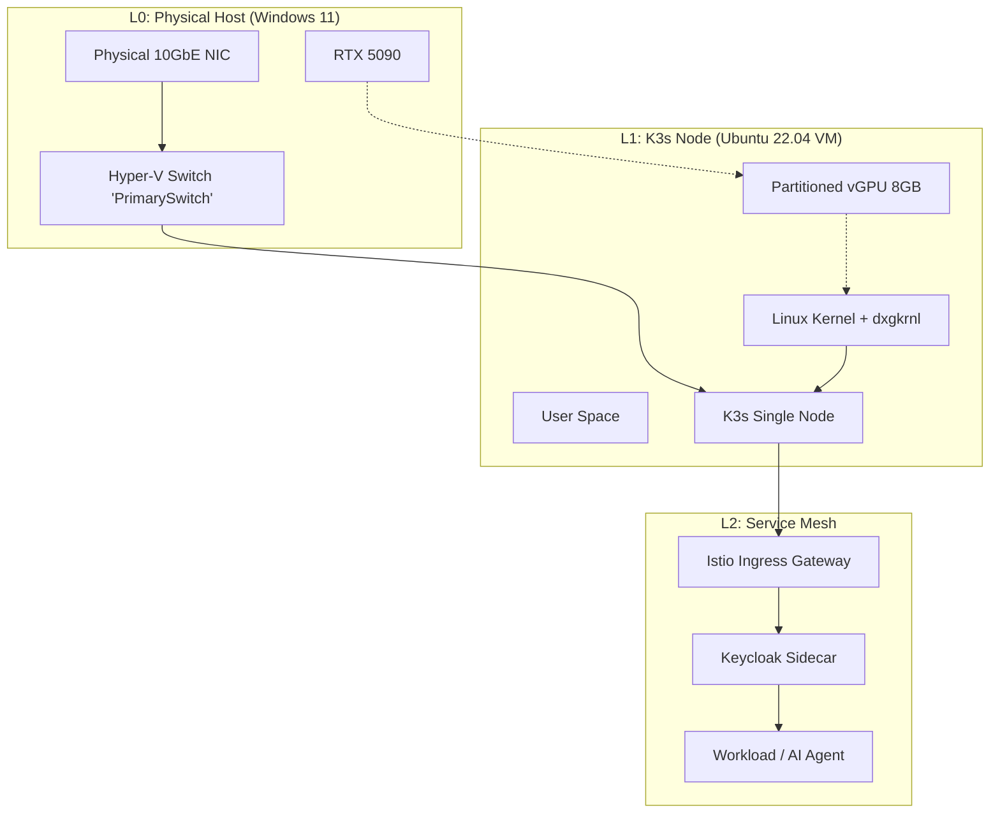

# 🚀 Homelab & AI Orchestration: Master Engineering Specification

## Executive Summary
This project implements a **High-Assurance Hybrid Cloud** environment on local hardware. The mission is to provide a production-grade playground for **AI Agent Orchestration** and **Media Automation** while maintaining strict **NIST 800-53 Rev 5** security controls.

### Hardware Core
* **CPU:** AMD Ryzen 9 9950X3D (16C/32T) — *AMD-V & SVM Enabled*
* **GPU:** NVIDIA RTX 5090 (32GB VRAM) — *GPU-P Enabled*
* **Memory:** 64GB DDR5 (ECC Preferred)
* **Storage:** NVMe Gen5 RAID (Data Integrity Layer)

---

## 1. System Architecture & Virtualization Topology 🏗️

The environment utilizes **Type 1 Hypervisor (Hyper-V)** to host the AI workload directly. This eliminates nested virtualization overhead and solves kernel compatibility issues for GPU partitioning.

### 1.1 Virtualization & Network Topology (L1)



### 1.2 Resource Allocation

| Hardware Component | Allocation Strategy | Host (Win 11) | Guest (Ubuntu VM) |
| :--- | :--- | :--- | :--- |
| **CPU (9950X3D)** | Game Mode Scheduling | 8 Cores (Gaming) | 8 Cores (Lab Services) |
| **GPU (RTX 5090)** | GPU-P (Partitioning) | 100% 3D / Video Enc | ~25-50% CUDA Compute |
| **RAM (64GB)** | Static Allocation | 32GB Reserved | 32GB Static |
| **Network** | Virtual Switch | 10GbE Native | Virtualized Bridge |

---

## 2. NIST 800-53 Rev 5 Compliance Mapping 🛡️
*(Unchanged - See Implementation Plan)*

---

## 3. Secret Management Specification (SOPS + age) 🔑
*(Unchanged - See Implementation Plan)*

---

## 4. Service Mesh & Zero-Trust Networking 🌐
*(Unchanged - See Implementation Plan)*

---

## 5. The GPU Pipeline: Gaming & AI Coexistence 🏎️

To utilize the RTX 5090 for both 4K gaming and AI workloads, we implement **GPU Partitioning (GPU-P)** directly on Hyper-V.

### 5.1 Host-Level Partitioning Logic (PowerShell)
Handled automatically by `scripts/provision-ubuntu.ps1`.

### 5.2 Guest Configuration
*   **OS**: Ubuntu 22.04 LTS (Kernel 5.15+ Azure-tuned)
*   **Driver**: NVIDIA Server Driver 535+
*   **Runtime**: Nvidia Container Toolkit

---

## 6. Implementation Flight Manual ⚓

### Step 1: BIOS & Hardware Prep
Enable SVM, IOMMU, SR-IOV in BIOS.

### Step 2: Host Tooling (PowerShell Admin)
```powershell
choco install -y git ansible sops age.portable kubernetes-cli kubernetes-helm
```

### Step 3: Provisioning K3s Node (PowerShell)

We use a unified script to create the Ubuntu VM, configure the Network, and partitioning the GPU.

**Prerequisite:** Download **Ubuntu 22.04 Server ISO**.

```powershell
# Run in Admin PowerShell
.\scripts\provision-ubuntu.ps1 -IsoPath "C:\Path\To\ubuntu-22.04-live-server-amd64.iso"
```

1.  Connect to the VM ("K3s-Node").
2.  Install Ubuntu Server.
    *   **Important**: Enable "Install OpenSSH Server".
3.  Note the IP address (`ip addr`).

### Step 4: K3s & AI Bootstrap (Ansible)

We use Ansible to provision the cluster and drivers.

1.  **Update Inventory**: Edit `ansible/inventory/hosts.ini` with your new VM's IP.
2.  **Bootstrap**:

```bash
# On Proxmox/Ubuntu VM (SSH in first)
# Copy the 'ansible' and 'scripts' folders to the VM via SCP first!

chmod +x scripts/bootstrap-ansible.sh
./scripts/bootstrap-ansible.sh
```

This acts as a "One-Click Deploy" for:
*   K3s Cluster
*   Networking (MetalLB + Istio)
*   NVIDIA Drivers & Container Toolkit

### Step 5: Verification

**Check GPU:**
```bash
nvidia-smi
# Should list the RTX 5090 (partitioned)
```

**Check Kubernetes:**
```bash
kubectl describe node | grep nvidia.com/gpu
# Should show capacity: 1
```

---

## 7. Repository Directory Structure 📂
*(Updated to match cleanup)*